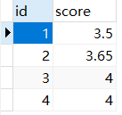
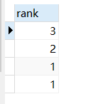

   * [175. 组合两个表](#175-组合两个表)
   * [176. 第二高的薪水](#176-第二高的薪水)
   * [177. 第N高的薪水](#177-第N高的薪水)
   * [178. 分数排名](#178-分数排名)

# 175. 组合两个表

<B>题目</B>   
<B>表1: Person</B>  

```text
+-------------+---------+  
| 列名         | 类型     |    
+-------------+---------+  
| PersonId    | int     |  
| FirstName   | varchar |  
| LastName    | varchar |  
+-------------+---------+  

```

PersonId 是上表主键  
<B>表2: Address</B>   

```text
+-------------+---------+  
| 列名         | 类型    |  
+-------------+---------+  
| AddressId   | int     |  
| PersonId    | int     |  
| City        | varchar |  
| State       | varchar |  
+-------------+---------+  

```

AddressId 是上表主键  
<B>要求：</B>  
编写一个 SQL 查询，满足条件：无论 person 是否有地址信息，都需要基于上述两表提供 person 的以下信息：
FirstName, LastName, City, State  
<B>分析：</B>  
第一步：分析无论 person 是否有地址信息，都需要基于上述两表提供person 的以下信息：FirstName, LastName, City, State  
第二步：想到左连接的定义：以左表为准，去右表找匹配数据，找不到匹配用null补齐
<B>结论：</B>  
以Person为主表left join 地址信息表Address，然后用on关联。  
on和where条件的区别如下： 
1、on条件是在生成临时表（两表相连，会根据条件生成临时表，然后返回数据）时使用的条件，它不管on中的条件是否为真，都会返回左边表中的记录。  
2、where条件是在临时表生成好后，再对临时表进行过滤的条件。这时已经没有left join的含义（必须返回左边表的记录）了，条件不为真的就全部过滤掉。  
<B>sql：</B>  

```sql
select p.FirstName,p.LastName,a.City,a.State from Person p left join Address a 
on p.PersonId=a.PersonId
```

# 176. 第二高的薪水

**题目**

编写一个 SQL 查询，获取 Employee 表中第二高的薪水（Salary） 。

```text
+----+--------+  
| Id | Salary |  
+----+--------+  
| 1  | 100    |  
| 2  | 200    |  
| 3  | 300    |
```

例如上述 Employee 表，SQL查询应该返回 200 作为第二高的薪水。如果不存在第二高的薪水，那么查询应返回 null。

```text
+---------------------+  
| SecondHighestSalary |  
+---------------------+  
| 200                 |  
+---------------------+
```

**分析**：

第一步：这种第几高、第几低，的sql,要想要用order by进行排序、limit进行取数据、distinct去重(以便数据重复时确定limit的偏移量)

第二步：考虑不存在，返回null的问题。有两种方式，其一：借助中间表，查值；其二：利用ifnull()函数

**结论：**

对salary列去重、降序排序并取第2个、再在外面套一层查询，达到不存在返回null的目的。

扩展：

limit[offset],[n]:offset:偏移量，N:取出条目，offset如果不写相当于limit 0,N,如取前三条limit 3相当于limit 0,3

ifnull(expr1,expr2):假如expr1不为null,则ifnull()返回值expr1,否则其返回值为expr2

**sql1**

```sql
SELECT
	( SELECT DISTINCT salary FROM Employee ORDER BY salary DESC LIMIT 1, 1 ) AS SecondHighestSalary;
```

**sql2**

```sql
SELECT
	IFNULL( ( SELECT DISTINCT Salary FROM Employee ORDER BY Salary DESC LIMIT 1 OFFSET 1 ), NULL ) AS SecondHighestSalary
```

# 177. 第N高的薪水

**题目**

编写一个 SQL 查询，获取 `Employee` 表中第 *n* 高的薪水（Salary）。

```text
+----+--------+
| Id | Salary |
+----+--------+
| 1  | 100    |
| 2  | 200    |
| 3  | 300    |
+----+--------+
```

例如上述 `Employee` 表，*n = 2* 时，应返回第二高的薪水 `200`。如果不存在第 *n* 高的薪水，那么查询应返回 `null`。

```text
+------------------------+
| getNthHighestSalary(2) |
+------------------------+
| 200                    |
+------------------------+
```

**分析**：

第一步，这道题同176.第二高的薪水，可以说的一样的，只不过是变成了用函数来写，并且第二高变成了变量第n高

第二步，根据limit的特性来说，第n高，偏移量是n-1即跳过前n-1条数，从第n条取并取一条，就是n高的薪水。

第三步，由于limit后面不能有-1或者n-1这样的计算出现，需要在函数前面的begin处声明需要用到的变量。

第四步，由于n是可变的，就需要考虑n的值是否小于1，如果小于1，此时变量n-1小于0逻辑不成立就返回null。

**结论：**

在begin中通过declare声明一个变量，其值为n-1,并对此变量进行判断，小于0，不成立返回null,return部分和题"第二高的薪水"一致。

**sql:**

```sql
CREATE FUNCTION getNthHighestSalary(N INT) RETURNS INT
BEGIN
  declare n int default n-1;
  if(n<0) then 
  return null;
  else
  RETURN (
    select ifnull((select distinct(Salary) from employee order by Salary desc limit n,1),null);
  ); 
  end if;
END
```

# 178. 分数排名

**题目**

编写一个 SQL 查询来实现分数排名。

如果两个分数相同，则两个分数排名（Rank）相同。请注意，平分后的下一个名次应该是下一个连续的整数值。换句话说，名次之间不应该有“间隔”。

```text
+----+-------+
| Id | Score |
+----+-------+
| 1  | 3.50  |
| 2  | 3.65  |
| 3  | 4.00  |
| 4  | 3.85  |
| 5  | 4.00  |
| 6  | 3.65  |
+----+-------+
```

例如，根据上述给定的 `Scores` 表，你的查询应该返回（按分数从高到低排列）：

```text
+-------+------+
| Score | Rank |
+-------+------+
| 4.00  | 1    |
| 4.00  | 1    |
| 3.85  | 2    |
| 3.65  | 3    |
| 3.65  | 3    |
| 3.50  | 4    |
+-------+------+
```

**分析**：

第一步，从查询结果来看，分数score列数据是降序展示的，排名rank是升序排序的，并且分数score是可重复的，重复的分数排名一样。

第二步，由于只有一张表，考虑到用自关联，在mysql中，一张表就是一个集合，两表关联，就是求笛卡尔积的过程，其实就是两个集合的完全组合。比如：现在score表中数据如下图：



那么自关联:SELECT s1.score FROM scores s1,scores s2 的结果就有16条,但是表里面的score列数据就有4行数据，所以需要根据id分组，sql为：SELECT s1.score FROM scores s1,scores s2  group by s1.id。现在score已经出来了，需要求每个分数对应的名次比如求3.65所占的名次，我们知道它是第二名，分数大于等于3.65的分数个数有3个，我们对分数个数去重查询得到分数个数2即为3.65的排名，sql为：SELECT count( DISTINCT s2.score ) rank FROM scores s1,scores s2 WHERE s2.score >= s1.score GROUP BY s1.id 结果为：



**结论：**

自关联查询，关联条件为s2.score>=s1.score，用s1.score查分数了，s2.score查询名次列，需要根据id分组，不然查出的数据只有表数据的第一条分数，以及它所对应的名次。

**sql:**

```sql
SELECT
	s1.score,
	count( DISTINCT s2.score ) rank 
FROM
	scores s1,
	scores s2 
WHERE
	s2.score >= s1.score 
GROUP BY
	s1.id 
ORDER BY
	rank
```

